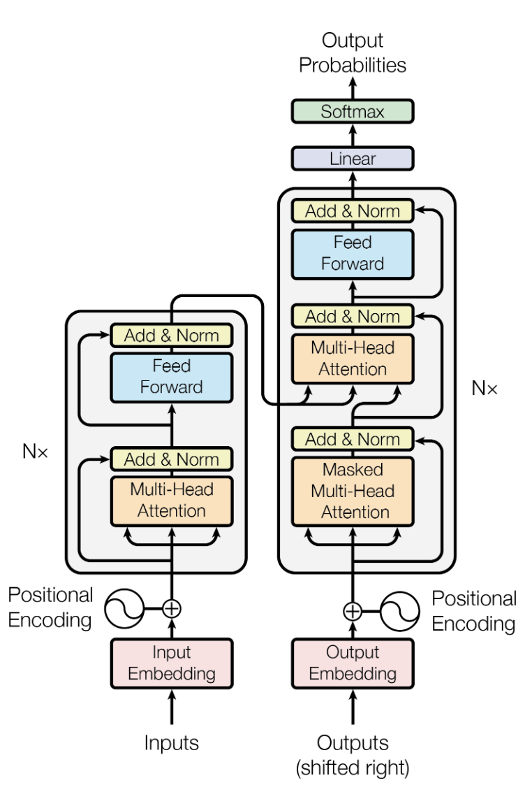
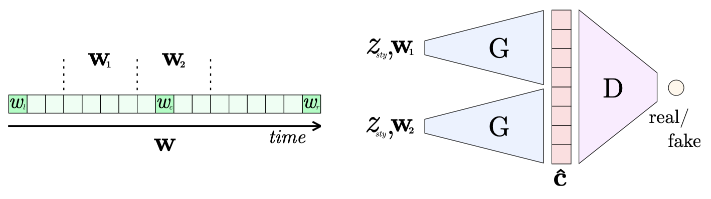
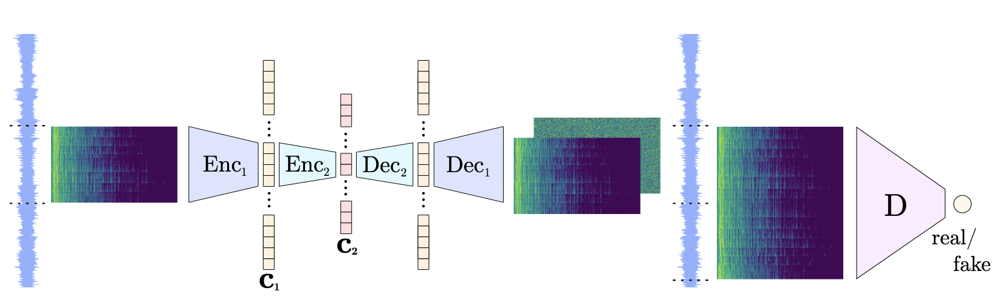

# Tag-based Audio Generation

## Description

Audio generation when given a genre as natural language input 

## Link to demo app

[Google Colab Notebook](https://colab.research.google.com/drive/17G45yw0ZzsD84X-Q3RHPy6ER9Pb-u6hK)

## Youtube Video demo

https://user-images.githubusercontent.com/38502391/206556651-da596bd5-7257-4985-8202-0a2f7bc0313f.mp4

## System Architecture Diagram

### Explanation

User inputs a genre tag into frontend. This tag is passed to semantic similarity NLP model to determine nearest tag within training space, and implicitly coerces to (outputs) the found tag. This tag is passed to the audio generation model as input, which produces generated audio that is playable on the frontend.

## Model Architecture Diagrams

The BERT Base NLP model is based on a general use transformer. The model is extensively pre-trained on a "corpus of English data." After which the model can be finetuned through less resource intensive training to produce state-of-the-art results. Check the citations to find a link to an interactive verison of the model.

The GAN model to generate the music utilizes the architecture shown above. It uses embeddings generated from encodings of music to train the discriminator and generator. Input is provided in the form of a sequence which is made of two seperate sequences joined together that are combined with respect to time. The model is then trianed on these sequences to generate sequnces that flow according to time.

The Encoder/Decoder model converts audio files into spectrograms which it uses to create embeddings. Encodings of the various audio files provided for training are created during this process and saved. After the GAN generates a sequence using the provided encodings the decoder decodes them and outputs the the spectrogrma of the model which is then converted back to waveform. 

## Directory Guide

 - `assets/`
	 - `system_architecture.png`: System architecture diagram
     - `video_demo.mp4`: Video demonstration of generating and playing audio on frontend
 - `.gitignore`: List of files and folders to ignore when committing to repo
 - `frontend.ipynb`: Python notebook with frontend of demo app
 - `model_trainer`: Python notebook to train the model on an example (or user-provided) dataset
 - `model_tester`: Python notebook for generating audio for subjective evaluation by user ("testing")

## Training Instructions

1. Open `model_trainer.ipynb` in Google Colab, Jupyter Notebook, or other Python Notebook software.
2. Run the `Setup` cell. This installs necessary dependencies and packages. This will also prompt you to connect your Google Drive so you may later point the notebook to your dataset if it is hosted there.
3. In the `Inputs` cell, provide the name of the genre of your dataset. You can provide some other tag-like categorical descriptor such as mood or theme that is common to your dataset if needed. If you do not have your own dataset or would like to train upon a general one, provide the genre name "**example**" as input. This will download a dataset for you.
4. In the `Inputs` cell, provide the path to your dataset - this should be a folder containing audio files. This step is <u>optional</u> if, as mentioned in the previous step, you used input the genre name as "example".
5. Run the `Encode Dataset` cell. This will encode your dataset into a format usable by the generation model for training.
6. Run the cell titled `Train model on dataset`. After training, the cell will print the path to the folder with model weights.

## Testing Instructions

1. Open `model_tester.ipynb` in Google Colab, Jupyter Notebook, or other Python Notebook software.
2. Run the `Setup` cell. This installs necessary dependencies and packages, as well as the pretrained NLP and generation models.
3. In the `Generate Audio` cell, input the name of a genre. 
4. Run the `Generate Audio` cell. This will output a playable HTML Audio element which you can use to listen to the generated audio. Since this is a generation model, you can subjectively assess audio quality and genre to "test" the model.

## Citations and References

 @article{
    author          =   {Marco Pasini and
                        Jan Schlüter},
    title           =   {Musika! Fast Infinite Waveform Music Generation},
    year            =   {2022},
    url             =   {https://github.com/marcoppasini/musika },
    archivePrefix   =   {arXiv},
    doi             =   {10.48550/ARXIV.2208.08706}
 }

@article{
    DBLP:journals/corr/abs-1810-04805,
    author          =   {Jacob Devlin and
                        Ming{-}Wei Chang and
                        Kenton Lee and
                        Kristina Toutanova},
    title           =   {{BERT:} Pre-training of Deep Bidirectional Transformers for Language
                        Understanding},
    journal         =   {CoRR},
    volume          =   {abs/1810.04805},
    year            =   {2018},
    url             =   {https://huggingface.co/bert-base-uncased },
    archivePrefix   =   {arXiv},
    eprint          =   {1810.04805},
    timestamp       =   {Tue, 30 Oct 2018 20:39:56 +0100},
    biburl          =   {https://dblp.org/rec/journals/corr/abs-1810-04805.bib},
    bibsource       =   {dblp computer science bibliography, https://dblp.org}
}
