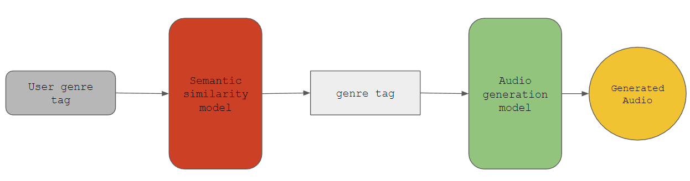

# Tag-based Audio Generation

## Description

Audio generation when given a genre as natural language input 

## Link to demo app

[Google Colab Notebook](https://colab.research.google.com/drive/17G45yw0ZzsD84X-Q3RHPy6ER9Pb-u6hK)

## Youtube Video demo

## System Architecture Diagram

### Explanation

User inputs a genre tag into frontend. This tag is passed to semantic similarity NLP model to determine nearest tag within training space, and implicitly coerces to (outputs) the found tag. This tag is passed to the audio generation model as input, which produces generated audio that is playable on the frontend.

## Model Architecture Diagrams

TODO: NLP model diagram

TODO: Audio generation model diagram

## Directory Guide

 - `assets/`
	 - `system_architecture.png`: System architecture diagram
     - `video_demo.mp4`: Video demonstration of generating and playing audio on frontend
 - `.gitignore`: List of files and folders to ignore when committing to repo
 - `frontend.ipynb`: Python notebook with frontend of demo app
 - `model_trainer`: Python notebook to train the model on an example (or user-provided) dataset
 - `model_tester`: Python notebook for generating audio for subjective evaluation by user ("testing")

## Training Instructions

1. Open `model_trainer.ipynb` in Google Colab, Jupyter Notebook, or other Python Notebook software.
2. Run the `Setup` cell. This installs necessary dependencies and packages. This will also prompt you to connect your Google Drive so you may later point the notebook to your dataset if it is hosted there.
3. In the `Inputs` cell, provide the name of the genre of your dataset. You can provide some other tag-like categorical descriptor such as mood or theme that is common to your dataset if needed. If you do not have your own dataset or would like to train upon a general one, provide the genre name "**example**" as input. This will download a dataset for you.
4. In the `Inputs` cell, provide the path to your dataset - this should be a folder containing audio files. This step is <u>optional</u> if, as mentioned in the previous step, you used input the genre name as "example".
5. Run the `Encode Dataset` cell. This will encode your dataset into a format usable by the generation model for training.
6. Run the cell titled `Train model on dataset`. After training, the cell will print the path to the folder with model weights.

## Testing Instructions

1. Open `model_tester.ipynb` in Google Colab, Jupyter Notebook, or other Python Notebook software.
2. Run the `Setup` cell. This installs necessary dependencies and packages, as well as the pretrained NLP and generation models.
3. In the `Generate Audio` cell, input the name of a genre. 
4. Run the `Generate Audio` cell. This will output a playable HTML Audio element which you can use to listen to the generated audio. Since this is a generation model, you can subjectively assess audio quality and genre to "test" the model.

## Citations and References

TODO
